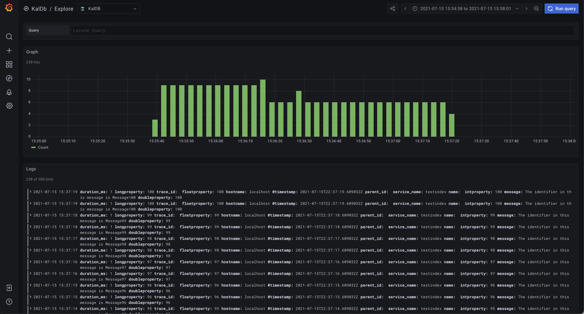

# KalDB Grafana App

This Grafana plugin adds support for [KalDB](https://github.com/slackhq/kaldb), and includes both a datasource and 
simplified explore interface.

To get started [install](https://grafana.com/docs/grafana/latest/plugins/installation/) this app, then enable it from 
the Grafana plugins page under "KalDB by Slack". Once installed a new datasource type will be available, and the KalDB
explore icon will appear on the left side of the Grafana UI.

## Other resources
* [Getting started with development](.github/CONTRIBUTING.md#getting-started-with-development)
