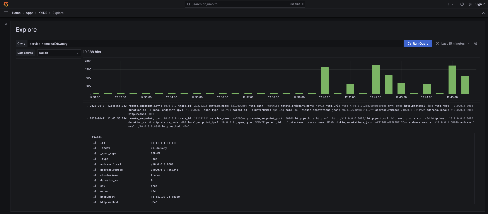

# KalDb Grafana App

This project extends functionality provided by Grafana to support integration with the 
[KalDb](https://github.com/slackhq/kaldb) datastore. The Grafana app includes a datasource and an improved explore 
interface to support features such as full-range histograms. 

To get started [install](https://grafana.com/docs/grafana/latest/plugins/installation/) this app, then enable it from 
the Grafana plugins page under "KalDb by Slack". Once installed a new datasource type will be available, and the KalDb
explore icon will appear on the left side of the Grafana UI.



## KalDb vs Elasticsearch datasource
⚠️ The KalDb datasource does not currently have a stable release, so prefer using the 
[Elasticsearch API compatibility](https://github.com/slackhq/kaldb/blob/a6582a5f1e73ef69058b6a51b602328873498ab0/kaldb/src/main/java/com/slack/kaldb/elasticsearchApi/ElasticsearchApiService.java) 
provided by KalDb when configuring a datasource.

## Requirements
* Grafana `>= 8.0.0`

## Development

### Frontend

1. Install dependencies

   ```bash
   yarn install
   ```

2. Build plugin in development mode or run in watch mode

   ```bash
   yarn dev
   ```

   or

   ```bash
   yarn watch
   ```

3. Build plugin in production mode

   ```bash
   yarn build
   ```

### Backend

1. Update [Grafana plugin SDK for Go](https://grafana.com/docs/grafana/latest/developers/plugins/backend/grafana-plugin-sdk-for-go/) dependency to the latest minor version:

   ```bash
   go get -u github.com/grafana/grafana-plugin-sdk-go
   go mod tidy
   ```

2. Build backend plugin binaries for Linux, Windows and Darwin:

   ```bash
   mage -v
   ```

3. List all available Mage targets for additional commands:

   ```bash
   mage -l
   ```

## Learn more

- [Build a app plugin tutorial](https://grafana.com/tutorials/build-a-app-plugin)
- [Build a data source backend plugin tutorial](https://grafana.com/tutorials/build-a-data-source-backend-plugin)
- [Grafana documentation](https://grafana.com/docs/)
- [Grafana Tutorials](https://grafana.com/tutorials/) - Grafana Tutorials are step-by-step guides that help you make the most of Grafana
- [Grafana UI Library](https://developers.grafana.com/ui) - UI components to help you build interfaces using Grafana Design System
- [Grafana plugin SDK for Go](https://grafana.com/docs/grafana/latest/developers/plugins/backend/grafana-plugin-sdk-for-go/)
